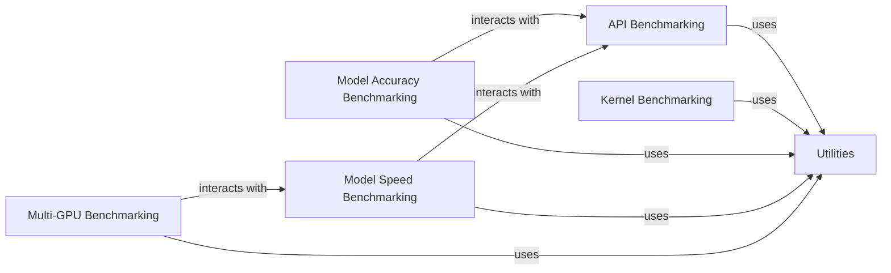

## Component Details

The `dgl.benchmarks` component is designed for evaluating the performance, accuracy, and speed of DGL's API and GNN models. It is organized into several sub-components, each focusing on a specific aspect of benchmarking. These components collectively provide a comprehensive framework for assessing the quality and performance of the DGL library, covering different levels of abstraction from low-level kernel operations to end-to-end model training, and addressing critical aspects like accuracy, speed, and scalability. This allows DGL developers to identify areas for improvement and users to make informed decisions about model and API usage.

### API Benchmarking

This sub-component contains a collection of scripts and utilities specifically designed to benchmark the performance of various DGL API calls. This includes operations like graph construction, edge/node manipulation, and message passing primitives.

**Related Classes/Methods**:

- <a href="https://github.com/dmlc/dgl/blob/master/benchmarks/benchmarks/api/bench_add_self_loop.py#L0-L0" target="_blank" rel="noopener noreferrer">`dgl.benchmarks.benchmarks.api.bench_add_self_loop` (0:0)</a>

- <a href="https://github.com/dmlc/dgl/blob/master/benchmarks/benchmarks/api/bench_batch.py#L0-L0" target="_blank" rel="noopener noreferrer">`dgl.benchmarks.benchmarks.api.bench_batch` (0:0)</a>

- <a href="https://github.com/dmlc/dgl/blob/master/benchmarks/benchmarks/api/bench_builtin_update_all_coo.py#L0-L0" target="_blank" rel="noopener noreferrer">`dgl.benchmarks.benchmarks.api.bench_builtin_update_all_coo` (0:0)</a>

- <a href="https://github.com/dmlc/dgl/blob/master/benchmarks/benchmarks/api/bench_sample_neighbors.py#L0-L0" target="_blank" rel="noopener noreferrer">`dgl.benchmarks.benchmarks.api.bench_sample_neighbors` (0:0)</a>

### Kernel Benchmarking

This component focuses on benchmarking the performance of DGL's low-level kernel operations, such as `edgesoftmax`, `gsddmm`, and `gspmm`. These are fundamental building blocks for many GNN operations.

**Related Classes/Methods**:

- <a href="https://github.com/dmlc/dgl/blob/master/benchmarks/benchmarks/kernel/bench_edgesoftmax.py#L0-L0" target="_blank" rel="noopener noreferrer">`dgl.benchmarks.benchmarks.kernel.bench_edgesoftmax` (0:0)</a>

- <a href="https://github.com/dmlc/dgl/blob/master/benchmarks/benchmarks/kernel/bench_gsddmm_u_dot_v.py#L0-L0" target="_blank" rel="noopener noreferrer">`dgl.benchmarks.benchmarks.kernel.bench_gsddmm_u_dot_v` (0:0)</a>

- <a href="https://github.com/dmlc/dgl/blob/master/benchmarks/benchmarks/kernel/bench_gspmm_u_mul_e_sum.py#L0-L0" target="_blank" rel="noopener noreferrer">`dgl.benchmarks.benchmarks.kernel.bench_gspmm_u_mul_e_sum` (0:0)</a>

### Model Accuracy Benchmarking

This sub-component provides scripts to evaluate the accuracy of various common GNN models implemented in DGL, such as GAT, GCN, RGCN, and SAGE. It helps in verifying the correctness of model implementations and comparing their performance on standard datasets.

**Related Classes/Methods**:

- <a href="https://github.com/dmlc/dgl/blob/master/benchmarks/benchmarks/model_acc/bench_gat.py#L0-L0" target="_blank" rel="noopener noreferrer">`dgl.benchmarks.benchmarks.model_acc.bench_gat` (0:0)</a>

- <a href="https://github.com/dmlc/dgl/blob/master/benchmarks/benchmarks/model_acc/bench_gcn.py#L0-L0" target="_blank" rel="noopener noreferrer">`dgl.benchmarks.benchmarks.model_acc.bench_gcn` (0:0)</a>

- <a href="https://github.com/dmlc/dgl/blob/master/benchmarks/benchmarks/model_acc/bench_rgcn_base.py#L0-L0" target="_blank" rel="noopener noreferrer">`dgl.benchmarks.benchmarks.model_acc.bench_rgcn_base` (0:0)</a>

- <a href="https://github.com/dmlc/dgl/blob/master/benchmarks/benchmarks/model_acc/bench_sage.py#L0-L0" target="_blank" rel="noopener noreferrer">`dgl.benchmarks.benchmarks.model_acc.bench_sage` (0:0)</a>

### Model Speed Benchmarking

This component is dedicated to measuring the training and inference speed of different GNN models within DGL. It includes benchmarks for models like GAT, GCN, PinSAGE, and RGCN, often with variations for different sampling strategies (e.g., neighbor sampling).

**Related Classes/Methods**:

- <a href="https://github.com/dmlc/dgl/blob/master/benchmarks/benchmarks/model_speed/bench_gat.py#L0-L0" target="_blank" rel="noopener noreferrer">`dgl.benchmarks.benchmarks.model_speed.bench_gat` (0:0)</a>

- <a href="https://github.com/dmlc/dgl/blob/master/benchmarks/benchmarks/model_speed/bench_pinsage.py#L0-L0" target="_blank" rel="noopener noreferrer">`dgl.benchmarks.benchmarks.model_speed.bench_pinsage` (0:0)</a>

- <a href="https://github.com/dmlc/dgl/blob/master/benchmarks/benchmarks/model_speed/bench_rgcn_base.py#L0-L0" target="_blank" rel="noopener noreferrer">`dgl.benchmarks.benchmarks.model_speed.bench_rgcn_base` (0:0)</a>

- <a href="https://github.com/dmlc/dgl/blob/master/benchmarks/benchmarks/model_speed/bench_sage_ns.py#L0-L0" target="_blank" rel="noopener noreferrer">`dgl.benchmarks.benchmarks.model_speed.bench_sage_ns` (0:0)</a>

### Multi-GPU Benchmarking

This sub-component focuses on evaluating the performance of DGL when utilizing multiple GPUs for training GNN models, specifically for models like RGCN and SAGE. It helps assess the scalability and efficiency of distributed training.

**Related Classes/Methods**:

- <a href="https://github.com/dmlc/dgl/blob/master/benchmarks/benchmarks/multigpu/bench_multigpu_rgcn.py#L0-L0" target="_blank" rel="noopener noreferrer">`dgl.benchmarks.benchmarks.multigpu.bench_multigpu_rgcn` (0:0)</a>

- <a href="https://github.com/dmlc/dgl/blob/master/benchmarks/benchmarks/multigpu/bench_multigpu_sage.py#L0-L0" target="_blank" rel="noopener noreferrer">`dgl.benchmarks.benchmarks.multigpu.bench_multigpu_sage` (0:0)</a>

- <a href="https://github.com/dmlc/dgl/blob/master/benchmarks/benchmarks/multigpu/rgcn_model.py#L0-L0" target="_blank" rel="noopener noreferrer">`dgl.benchmarks.benchmarks.multigpu.rgcn_model` (0:0)</a>

### Utilities

This module likely contains helper functions, common configurations, data loading utilities, and other shared code used across the various benchmarking scripts.

**Related Classes/Methods**:

- <a href="https://github.com/dmlc/dgl/blob/master/benchmarks/benchmarks/utils.py#L0-L0" target="_blank" rel="noopener noreferrer">`dgl.benchmarks.benchmarks.utils` (0:0)</a>

### [FAQ](https://github.com/CodeBoarding/GeneratedOnBoardings/tree/main?tab=readme-ov-file#faq)