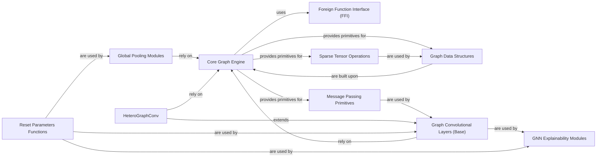

## Component Details

The `Core Graph Engine` is the fundamental layer of DGL, providing the basic building blocks for graph operations and serving as the interface to the optimized C/C++ backend. It is crucial for performance and defines the core data structures and primitives for Graph Neural Networks.

### Core Graph Engine

The foundational layer of DGL, responsible for managing fundamental graph data structures (nodes, edges, attributes), providing low-level graph manipulation, and serving as the Foreign Function Interface (FFI) to the optimized C/C++ backend for high-performance operations. It also defines the core message passing primitives and sparse tensor operations essential for Graph Neural Networks.

**Related Classes/Methods**:

- <a href="https://github.com/dmlc/dgl/blob/master/python/dgl/heterograph.py#L1-L1" target="_blank" rel="noopener noreferrer">`dgl/heterograph.py` (1:1)</a>

- <a href="https://github.com/dmlc/dgl/blob/master/python/dgl/graph_index.py#L1-L1" target="_blank" rel="noopener noreferrer">`dgl/graph_index.py` (1:1)</a>

- <a href="https://github.com/dmlc/dgl/blob/master/python/dgl/frame.py#L1-L1" target="_blank" rel="noopener noreferrer">`dgl/frame.py` (1:1)</a>

- <a href="https://github.com/dmlc/dgl/blob/master/python/dgl/core.py#L1-L1" target="_blank" rel="noopener noreferrer">`dgl/core.py` (1:1)</a>

- <a href="https://github.com/dmlc/dgl/blob/master/python/dgl/_ffi/__init__.py#L1-L1" target="_blank" rel="noopener noreferrer">`dgl/_ffi/__init__.py` (1:1)</a>

- <a href="https://github.com/dmlc/dgl/blob/master/python/dgl/ndarray.py#L1-L1" target="_blank" rel="noopener noreferrer">`dgl/ndarray.py` (1:1)</a>

- `dgl/sparse.py` (1:1)

- <a href="https://github.com/dmlc/dgl/blob/master/python/dgl/function/message.py#L1-L1" target="_blank" rel="noopener noreferrer">`dgl/function/message.py` (1:1)</a>

- <a href="https://github.com/dmlc/dgl/blob/master/python/dgl/function/reducer.py#L1-L1" target="_blank" rel="noopener noreferrer">`dgl/function/reducer.py` (1:1)</a>

- <a href="https://github.com/dmlc/dgl/blob/master/python/dgl/ops/__init__.py#L1-L1" target="_blank" rel="noopener noreferrer">`dgl/ops/__init__.py` (1:1)</a>

### Graph Data Structures

This component encompasses the core data structures used to represent graphs in DGL, including `DGLGraph` for general graphs and `DGLBlock` for representing computation graphs in mini-batch training. It also includes `GraphIndex` and `HeteroGraphIndex` for efficient indexing and manipulation of graph elements.

**Related Classes/Methods**:

- <a href="https://github.com/dmlc/dgl/blob/master/python/dgl/heterograph.py#L1-L1" target="_blank" rel="noopener noreferrer">`dgl/heterograph.py` (1:1)</a>

- <a href="https://github.com/dmlc/dgl/blob/master/python/dgl/graph_index.py#L1-L1" target="_blank" rel="noopener noreferrer">`dgl/graph_index.py` (1:1)</a>

- <a href="https://github.com/dmlc/dgl/blob/master/python/dgl/heterograph_index.py#L1-L1" target="_blank" rel="noopener noreferrer">`dgl/heterograph_index.py` (1:1)</a>

### Foreign Function Interface (FFI)

This component provides the mechanism for Python to interact with the highly optimized C/C++ backend of DGL. It includes classes like `Function`, `NDArrayBase`, and `ObjectBase` that bridge the gap between Python objects and their C/C++ counterparts, enabling efficient data transfer and computation.

**Related Classes/Methods**:

- <a href="https://github.com/dmlc/dgl/blob/master/python/dgl/_ffi/function.py#L1-L1" target="_blank" rel="noopener noreferrer">`dgl/_ffi/function.py` (1:1)</a>

- <a href="https://github.com/dmlc/dgl/blob/master/python/dgl/_ffi/ndarray.py#L1-L1" target="_blank" rel="noopener noreferrer">`dgl/_ffi/ndarray.py` (1:1)</a>

- <a href="https://github.com/dmlc/dgl/blob/master/python/dgl/_ffi/object.py#L1-L1" target="_blank" rel="noopener noreferrer">`dgl/_ffi/object.py` (1:1)</a>

### Message Passing Primitives

This component defines the fundamental operations for message passing in Graph Neural Networks, including `MessageFunction` for defining how messages are generated and `ReduceFunction` for defining how messages are aggregated at nodes. These primitives are essential for building any GNN layer.

**Related Classes/Methods**:

- <a href="https://github.com/dmlc/dgl/blob/master/python/dgl/function/message.py#L1-L1" target="_blank" rel="noopener noreferrer">`dgl/function/message.py` (1:1)</a>

- <a href="https://github.com/dmlc/dgl/blob/master/python/dgl/function/reducer.py#L1-L1" target="_blank" rel="noopener noreferrer">`dgl/function/reducer.py` (1:1)</a>

### Sparse Tensor Operations

This component provides functionalities for handling sparse tensors, which are common in graph data (e.g., adjacency matrices). It includes classes like `SparseMatrix` and `NDArray` for efficient storage and manipulation of sparse data, crucial for memory and computational efficiency in large graphs.

**Related Classes/Methods**:

- <a href="https://github.com/dmlc/dgl/blob/master/python/dgl/ndarray.py#L1-L1" target="_blank" rel="noopener noreferrer">`dgl/ndarray.py` (1:1)</a>

- `dgl/sparse.py` (1:1)

### Graph Convolutional Layers (Base)

A broad category encompassing various graph neural network layers that perform message passing and aggregation on graph structures. These layers are the building blocks for most GNN models.

**Related Classes/Methods**:

- <a href="https://github.com/dmlc/dgl/blob/master/python/dgl/nn/pytorch/conv/atomicconv.py#L1-L1" target="_blank" rel="noopener noreferrer">`dgl/nn/pytorch/conv/atomicconv.py` (1:1)</a>

- <a href="https://github.com/dmlc/dgl/blob/master/python/dgl/nn/pytorch/conv/cfconv.py#L1-L1" target="_blank" rel="noopener noreferrer">`dgl/nn/pytorch/conv/cfconv.py` (1:1)</a>

- <a href="https://github.com/dmlc/dgl/blob/master/python/dgl/nn/pytorch/conv/chebconv.py#L1-L1" target="_blank" rel="noopener noreferrer">`dgl/nn/pytorch/conv/chebconv.py` (1:1)</a>

- <a href="https://github.com/dmlc/dgl/blob/master/python/dgl/nn/pytorch/conv/gatconv.py#L1-L1" target="_blank" rel="noopener noreferrer">`dgl/nn/pytorch/conv/gatconv.py` (1:1)</a>

- <a href="https://github.com/dmlc/dgl/blob/master/python/dgl/nn/pytorch/conv/graphconv.py#L1-L1" target="_blank" rel="noopener noreferrer">`dgl/nn/pytorch/conv/graphconv.py` (1:1)</a>

- <a href="https://github.com/dmlc/dgl/blob/master/python/dgl/nn/pytorch/conv/sageconv.py#L1-L1" target="_blank" rel="noopener noreferrer">`dgl/nn/pytorch/conv/sageconv.py` (1:1)</a>

- <a href="https://github.com/dmlc/dgl/blob/master/python/dgl/nn/pytorch/conv/gcn2conv.py#L1-L1" target="_blank" rel="noopener noreferrer">`dgl/nn/pytorch/conv/gcn2conv.py` (1:1)</a>

- <a href="https://github.com/dmlc/dgl/blob/master/python/dgl/nn/pytorch/conv/tagconv.py#L1-L1" target="_blank" rel="noopener noreferrer">`dgl/nn/pytorch/conv/tagconv.py` (1:1)</a>

- <a href="https://github.com/dmlc/dgl/blob/master/python/dgl/nn/pytorch/conv/gatedgraphconv.py#L1-L1" target="_blank" rel="noopener noreferrer">`dgl/nn/pytorch/conv/gatedgraphconv.py` (1:1)</a>

- <a href="https://github.com/dmlc/dgl/blob/master/python/dgl/nn/pytorch/conv/nnconv.py#L1-L1" target="_blank" rel="noopener noreferrer">`dgl/nn/pytorch/conv/nnconv.py` (1:1)</a>

- <a href="https://github.com/dmlc/dgl/blob/master/python/dgl/nn/pytorch/conv/pnaconv.py#L1-L1" target="_blank" rel="noopener noreferrer">`dgl/nn/pytorch/conv/pnaconv.py` (1:1)</a>

- <a href="https://github.com/dmlc/dgl/blob/master/python/dgl/nn/pytorch/conv/cugraph_gatconv.py#L1-L1" target="_blank" rel="noopener noreferrer">`dgl/nn/pytorch/conv/cugraph_gatconv.py` (1:1)</a>

- <a href="https://github.com/dmlc/dgl/blob/master/python/dgl/nn/pytorch/conv/cugraph_relgraphconv.py#L1-L1" target="_blank" rel="noopener noreferrer">`dgl/nn/pytorch/conv/cugraph_relgraphconv.py` (1:1)</a>

- <a href="https://github.com/dmlc/dgl/blob/master/python/dgl/nn/pytorch/conv/cugraph_sageconv.py#L1-L1" target="_blank" rel="noopener noreferrer">`dgl/nn/pytorch/conv/cugraph_sageconv.py` (1:1)</a>

### Global Pooling Modules

A collection of modules designed to aggregate node and edge features into a single graph-level representation. They are crucial for graph classification and regression tasks.

**Related Classes/Methods**:

- `dgl/nn/pytorch/glob/set2set.py` (1:1)

- `dgl/nn/pytorch/glob/set_transformer.py` (1:1)

### HeteroGraphConv

A versatile module for performing convolutions on heterogeneous graphs. It allows defining different message-passing functions for each type of edge, enabling flexible modeling of complex graph structures.

**Related Classes/Methods**:

- `dgl/nn/pytorch/hetero/heterographconv.py` (1:1)

### GNN Explainability Modules

This category includes modules like `GNNExplainer`, `PGExplainer`, and `SubgraphX`, which provide methods to interpret and explain the predictions of Graph Neural Networks by identifying important nodes and edges.

**Related Classes/Methods**:

- <a href="https://github.com/dmlc/dgl/blob/master/python/dgl/nn/pytorch/explain/gnnexplainer.py#L1-L1" target="_blank" rel="noopener noreferrer">`dgl/nn/pytorch/explain/gnnexplainer.py` (1:1)</a>

- <a href="https://github.com/dmlc/dgl/blob/master/python/dgl/nn/pytorch/explain/pgexplainer.py#L1-L1" target="_blank" rel="noopener noreferrer">`dgl/nn/pytorch/explain/pgexplainer.py` (1:1)</a>

- <a href="https://github.com/dmlc/dgl/blob/master/python/dgl/nn/pytorch/explain/subgraphx.py#L1-L1" target="_blank" rel="noopener noreferrer">`dgl/nn/pytorch/explain/subgraphx.py` (1:1)</a>

### Reset Parameters Functions

A common pattern across many `dgl.nn.pytorch` modules, these functions are responsible for initializing the weights and biases of the neural network layers within a module. This ensures proper starting conditions for training.

**Related Classes/Methods**:

- `dgl/nn/pytorch/glob/set2set.py` (1:1)

- `dgl/nn/pytorch/glob/set_transformer.py` (1:1)

- <a href="https://github.com/dmlc/dgl/blob/master/python/dgl/nn/pytorch/conv/graphconv.py#L1-L1" target="_blank" rel="noopener noreferrer">`dgl/nn/pytorch/conv/graphconv.py` (1:1)</a>

- <a href="https://github.com/dmlc/dgl/blob/master/python/dgl/nn/pytorch/explain/gnnexplainer.py#L1-L1" target="_blank" rel="noopener noreferrer">`dgl/nn/pytorch/explain/gnnexplainer.py` (1:1)</a>

- <a href="https://github.com/dmlc/dgl/blob/master/python/dgl/nn/pytorch/conv/twirlsconv.py#L1-L1" target="_blank" rel="noopener noreferrer">`dgl/nn/pytorch/conv/twirlsconv.py` (1:1)</a>

### [FAQ](https://github.com/CodeBoarding/GeneratedOnBoardings/tree/main?tab=readme-ov-file#faq)