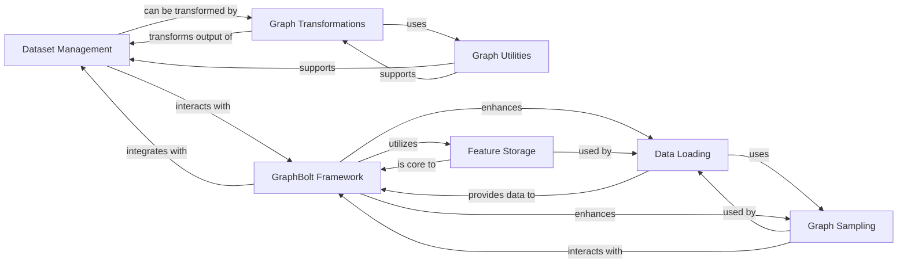

## Component Details

Manages and processes graph-related data, including datasets and data loading utilities.

### Dataset Management

Handles the loading, storage, and access of various graph datasets, including built-in datasets and custom CSV-based datasets. It provides a unified interface for different graph data sources.

**Related Classes/Methods**:

- <a href="https://github.com/dmlc/dgl/blob/master/python/dgl/data/dgl_dataset.py#L1-L1" target="_blank" rel="noopener noreferrer">`dgl.data.dgl_dataset.DGLDataset` (1:1)</a>

- <a href="https://github.com/dmlc/dgl/blob/master/python/dgl/data/dgl_dataset.py#L1-L1" target="_blank" rel="noopener noreferrer">`dgl.data.dgl_dataset.DGLBuiltinDataset` (1:1)</a>

- <a href="https://github.com/dmlc/dgl/blob/master/python/dgl/data/csv_dataset.py#L10-L213" target="_blank" rel="noopener noreferrer">`dgl.data.csv_dataset.CSVDataset` (10:213)</a>

### Data Loading

Provides efficient data loading mechanisms for GNN training, including batching and various sampling strategies to create mini-batches of graph data.

**Related Classes/Methods**:

- <a href="https://github.com/dmlc/dgl/blob/master/python/dgl/dataloading/dataloader.py#L787-L1259" target="_blank" rel="noopener noreferrer">`dgl.dataloading.dataloader.DataLoader` (787:1259)</a>

- <a href="https://github.com/dmlc/dgl/blob/master/python/dgl/dataloading/base.py#L163-L191" target="_blank" rel="noopener noreferrer">`dgl.dataloading.base.Sampler` (163:191)</a>

- <a href="https://github.com/dmlc/dgl/blob/master/python/dgl/dataloading/base.py#L194-L260" target="_blank" rel="noopener noreferrer">`dgl.dataloading.base.BlockSampler` (194:260)</a>

- <a href="https://github.com/dmlc/dgl/blob/master/python/dgl/dataloading/neighbor_sampler.py#L10-L205" target="_blank" rel="noopener noreferrer">`dgl.dataloading.neighbor_sampler.NeighborSampler` (10:205)</a>

### Graph Sampling

Implements various graph sampling algorithms (e.g., neighbor sampling, PinSAGE sampling) crucial for training GNNs on large graphs by creating subgraphs or mini-batches.

**Related Classes/Methods**:

- <a href="https://github.com/dmlc/dgl/blob/master/python/dgl/sampling/pinsage.py#L165-L271" target="_blank" rel="noopener noreferrer">`dgl.sampling.pinsage.PinSAGESampler` (165:271)</a>

- <a href="https://github.com/dmlc/dgl/blob/master/python/dgl/dataloading/neighbor_sampler.py#L10-L205" target="_blank" rel="noopener noreferrer">`dgl.dataloading.neighbor_sampler.NeighborSampler` (10:205)</a>

### Graph Transformations

Offers a collection of functions and modules to transform graphs, such as adding/removing edges, self-loops, and applying normalization or positional encodings.

**Related Classes/Methods**:

- <a href="https://github.com/dmlc/dgl/blob/master/python/dgl/transforms/module.py#L100-L107" target="_blank" rel="noopener noreferrer">`dgl.transforms.module.BaseTransform` (100:107)</a>

- <a href="https://github.com/dmlc/dgl/blob/master/python/dgl/transforms/module.py#L509-L649" target="_blank" rel="noopener noreferrer">`dgl.transforms.module.AddSelfLoop` (509:649)</a>

- <a href="https://github.com/dmlc/dgl/blob/master/python/dgl/transforms/module.py#L1587-L1634" target="_blank" rel="noopener noreferrer">`dgl.transforms.module.DropEdge` (1587:1634)</a>

- <a href="https://github.com/dmlc/dgl/blob/master/python/dgl/transforms/module.py#L1118-L1201" target="_blank" rel="noopener noreferrer">`dgl.transforms.module.GCNNorm` (1118:1201)</a>

- <a href="https://github.com/dmlc/dgl/blob/master/python/dgl/transforms/module.py#L1083-L1115" target="_blank" rel="noopener noreferrer">`dgl.transforms.module.Compose` (1083:1115)</a>

### Graph Utilities

Provides general utility functions and helper classes that support various graph operations across the DGL library, including internal error handling and data type consistency checks.

**Related Classes/Methods**:

- <a href="https://github.com/dmlc/dgl/blob/master/python/dgl/utils/internal.py#L21-L27" target="_blank" rel="noopener noreferrer">`dgl.utils.internal.InconsistentDtypeException` (21:27)</a>

### GraphBolt Framework

A high-performance framework designed for efficient graph data loading and sampling, particularly for large-scale GNN training. It introduces concepts like FeatureStore, SamplingGraph, and a dedicated DataLoader.

**Related Classes/Methods**:

- <a href="https://github.com/dmlc/dgl/blob/master/python/dgl/graphbolt/dataloader.py#L77-L190" target="_blank" rel="noopener noreferrer">`dgl.graphbolt.dataloader.DataLoader` (77:190)</a>

- <a href="https://github.com/dmlc/dgl/blob/master/python/dgl/graphbolt/feature_store.py#L138-L296" target="_blank" rel="noopener noreferrer">`dgl.graphbolt.feature_store.FeatureStore` (138:296)</a>

- <a href="https://github.com/dmlc/dgl/blob/master/python/dgl/graphbolt/sampling_graph.py#L10-L85" target="_blank" rel="noopener noreferrer">`dgl.graphbolt.sampling_graph.SamplingGraph` (10:85)</a>

- <a href="https://github.com/dmlc/dgl/blob/master/python/dgl/graphbolt/dataset.py#L50-L94" target="_blank" rel="noopener noreferrer">`dgl.graphbolt.dataset.Dataset` (50:94)</a>

- <a href="https://github.com/dmlc/dgl/blob/master/python/dgl/graphbolt/minibatch_transformer.py#L14-L45" target="_blank" rel="noopener noreferrer">`dgl.graphbolt.minibatch_transformer.MiniBatchTransformer` (14:45)</a>

- <a href="https://github.com/dmlc/dgl/blob/master/python/dgl/graphbolt/impl/neighbor_sampler.py#L639-L778" target="_blank" rel="noopener noreferrer">`dgl.graphbolt.impl.neighbor_sampler.NeighborSamplerImpl` (639:778)</a>

### Feature Storage

Manages the storage and retrieval of node and edge features, with implementations for CPU and GPU caching to optimize feature access during training.

**Related Classes/Methods**:

- <a href="https://github.com/dmlc/dgl/blob/master/python/dgl/graphbolt/feature_store.py#L138-L296" target="_blank" rel="noopener noreferrer">`dgl.graphbolt.feature_store.FeatureStore` (138:296)</a>

- <a href="https://github.com/dmlc/dgl/blob/master/python/dgl/graphbolt/feature_store.py#L25-L135" target="_blank" rel="noopener noreferrer">`dgl.graphbolt.feature_store.Feature` (25:135)</a>

- <a href="https://github.com/dmlc/dgl/blob/master/python/dgl/graphbolt/impl/cpu_cached_feature.py#L18-L461" target="_blank" rel="noopener noreferrer">`dgl.graphbolt.impl.cpu_cached_feature.CPUCachedFeature` (18:461)</a>

- <a href="https://github.com/dmlc/dgl/blob/master/python/dgl/graphbolt/impl/gpu_cached_feature.py#L17-L257" target="_blank" rel="noopener noreferrer">`dgl.graphbolt.impl.gpu_cached_feature.GPUCachedFeature` (17:257)</a>

- <a href="https://github.com/dmlc/dgl/blob/master/python/dgl/graphbolt/impl/torch_based_feature_store.py#L570-L664" target="_blank" rel="noopener noreferrer">`dgl.graphbolt.impl.torch_based_feature_store.TorchBasedFeatureStore` (570:664)</a>

### [FAQ](https://github.com/CodeBoarding/GeneratedOnBoardings/tree/main?tab=readme-ov-file#faq)