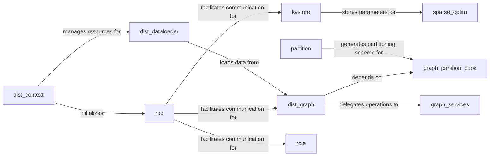

## Component Details

The `dgl.distributed` subsystem is crucial for enabling scalable graph processing in DGL by distributing graph data and computations across multiple machines. It provides the foundational infrastructure for building distributed graph neural networks (GNNs) and other graph-based applications.

### dist_context

Manages the distributed environment's lifecycle. It handles the initialization and finalization of the RPC (Remote Procedure Call) system and other distributed services. This component ensures that all processes in the distributed setup are properly configured and synchronized, providing a robust communication backbone. It also manages resource pooling for efficient operation.

**Related Classes/Methods**:

- <a href="https://github.com/dmlc/dgl/blob/master/python/dgl/distributed/dist_context.py#L207-L318" target="_blank" rel="noopener noreferrer">`dgl.distributed.dist_context.initialize` (207:318)</a>

- <a href="https://github.com/dmlc/dgl/blob/master/python/dgl/distributed/dist_context.py#L1-L1" target="_blank" rel="noopener noreferrer">`dgl.distributed.dist_context.finalize` (1:1)</a>

- <a href="https://github.com/dmlc/dgl/blob/master/python/dgl/distributed/dist_context.py#L1-L1" target="_blank" rel="noopener noreferrer">`dgl.distributed.dist_context.set_rank` (1:1)</a>

- <a href="https://github.com/dmlc/dgl/blob/master/python/dgl/distributed/dist_context.py#L1-L1" target="_blank" rel="noopener noreferrer">`dgl.distributed.dist_context.set_role` (1:1)</a>

- <a href="https://github.com/dmlc/dgl/blob/master/python/dgl/distributed/dist_context.py#L1-L1" target="_blank" rel="noopener noreferrer">`dgl.distributed.dist_context.set_group_id` (1:1)</a>

- <a href="https://github.com/dmlc/dgl/blob/master/python/dgl/distributed/dist_context.py#L113-L204" target="_blank" rel="noopener noreferrer">`dgl.distributed.dist_context.CustomPool` (113:204)</a>

### rpc

Implements the core Remote Procedure Call (RPC) mechanism for inter-process communication. It provides functionalities for sending and receiving messages, registering services, and managing remote function execution. This includes handling message serialization, network communication, and ensuring reliable data exchange between distributed nodes.

**Related Classes/Methods**:

- <a href="https://github.com/dmlc/dgl/blob/master/python/dgl/distributed/rpc.py#L1-L1" target="_blank" rel="noopener noreferrer">`dgl.distributed.rpc.send_request` (1:1)</a>

- <a href="https://github.com/dmlc/dgl/blob/master/python/dgl/distributed/rpc.py#L1-L1" target="_blank" rel="noopener noreferrer">`dgl.distributed.rpc.recv_response` (1:1)</a>

- <a href="https://github.com/dmlc/dgl/blob/master/python/dgl/distributed/rpc.py#L1-L1" target="_blank" rel="noopener noreferrer">`dgl.distributed.rpc.register_service` (1:1)</a>

- <a href="https://github.com/dmlc/dgl/blob/master/python/dgl/distributed/rpc.py#L1-L1" target="_blank" rel="noopener noreferrer">`dgl.distributed.rpc.set_rpc_worker_pool` (1:1)</a>

- <a href="https://github.com/dmlc/dgl/blob/master/python/dgl/distributed/rpc.py#L1-L1" target="_blank" rel="noopener noreferrer">`dgl.distributed.rpc.connect_to_server` (1:1)</a>

- <a href="https://github.com/dmlc/dgl/blob/master/python/dgl/distributed/rpc.py#L1-L1" target="_blank" rel="noopener noreferrer">`dgl.distributed.rpc.shutdown_workers` (1:1)</a>

- <a href="https://github.com/dmlc/dgl/blob/master/python/dgl/distributed/rpc.py#L1-L1" target="_blank" rel="noopener noreferrer">`dgl.distributed.rpc.RPCMessage` (1:1)</a>

### kvstore

Provides a distributed key-value store, essential for managing and sharing large-scale data (e.g., node/edge embeddings, model parameters) across the cluster. It supports operations like `pull` (retrieving data from servers), `push` (updating data on servers), data initialization, and deletion. It also manages distributed tensors (`DistTensor`) for efficient parameter storage.

**Related Classes/Methods**:

- <a href="https://github.com/dmlc/dgl/blob/master/python/dgl/distributed/kvstore.py#L961-L1579" target="_blank" rel="noopener noreferrer">`dgl.distributed.kvstore.KVClient` (961:1579)</a>

- <a href="https://github.com/dmlc/dgl/blob/master/python/dgl/distributed/kvstore.py#L731-L955" target="_blank" rel="noopener noreferrer">`dgl.distributed.kvstore.KVServer` (731:955)</a>

- <a href="https://github.com/dmlc/dgl/blob/master/python/dgl/distributed/kvstore.py#L1-L1" target="_blank" rel="noopener noreferrer">`dgl.distributed.kvstore.pull` (1:1)</a>

- <a href="https://github.com/dmlc/dgl/blob/master/python/dgl/distributed/kvstore.py#L1-L1" target="_blank" rel="noopener noreferrer">`dgl.distributed.kvstore.push` (1:1)</a>

- <a href="https://github.com/dmlc/dgl/blob/master/python/dgl/distributed/kvstore.py#L1-L1" target="_blank" rel="noopener noreferrer">`dgl.distributed.kvstore.init_data` (1:1)</a>

- <a href="https://github.com/dmlc/dgl/blob/master/python/dgl/distributed/kvstore.py#L1-L1" target="_blank" rel="noopener noreferrer">`dgl.distributed.kvstore.delete_data` (1:1)</a>

- <a href="https://github.com/dmlc/dgl/blob/master/python/dgl/distributed/kvstore.py#L1-L1" target="_blank" rel="noopener noreferrer">`dgl.distributed.kvstore.DistTensor` (1:1)</a>

### dist_graph

Represents a graph that is partitioned and distributed across multiple servers. It allows users to interact with this distributed graph as if it were a single entity, abstracting away the complexities of data distribution. It provides methods for accessing graph properties and performing graph operations in a distributed manner, with `DistGraphServer` handling server-side requests.

**Related Classes/Methods**:

- <a href="https://github.com/dmlc/dgl/blob/master/python/dgl/distributed/dist_graph.py#L647-L1679" target="_blank" rel="noopener noreferrer">`dgl.distributed.dist_graph.DistGraph` (647:1679)</a>

- <a href="https://github.com/dmlc/dgl/blob/master/python/dgl/distributed/dist_graph.py#L487-L644" target="_blank" rel="noopener noreferrer">`dgl.distributed.dist_graph.DistGraphServer` (487:644)</a>

- <a href="https://github.com/dmlc/dgl/blob/master/python/dgl/distributed/dist_graph.py#L1-L1" target="_blank" rel="noopener noreferrer">`dgl.distributed.dist_graph.partition_graph` (1:1)</a>

- <a href="https://github.com/dmlc/dgl/blob/master/python/dgl/distributed/dist_graph.py#L1-L1" target="_blank" rel="noopener noreferrer">`dgl.distributed.dist_graph.set_partition_book` (1:1)</a>

### graph_partition_book

Manages the metadata required for graph partitioning. It maps global node and edge IDs to their respective partitions and local IDs, enabling efficient data localization. It defines partition policies (e.g., `NodePartitionPolicy`, `EdgePartitionPolicy`) and provides mechanisms like `RangePartitionBook` for looking up where specific graph elements reside.

**Related Classes/Methods**:

- <a href="https://github.com/dmlc/dgl/blob/master/python/dgl/distributed/graph_partition_book.py#L266-L537" target="_blank" rel="noopener noreferrer">`dgl.distributed.graph_partition_book.GraphPartitionBook` (266:537)</a>

- <a href="https://github.com/dmlc/dgl/blob/master/python/dgl/distributed/graph_partition_book.py#L540-L964" target="_blank" rel="noopener noreferrer">`dgl.distributed.graph_partition_book.RangePartitionBook` (540:964)</a>

- <a href="https://github.com/dmlc/dgl/blob/master/python/dgl/distributed/graph_partition_book.py#L1139-L1145" target="_blank" rel="noopener noreferrer">`dgl.distributed.graph_partition_book.NodePartitionPolicy` (1139:1145)</a>

- <a href="https://github.com/dmlc/dgl/blob/master/python/dgl/distributed/graph_partition_book.py#L1148-L1158" target="_blank" rel="noopener noreferrer">`dgl.distributed.graph_partition_book.EdgePartitionPolicy` (1148:1158)</a>

### dist_dataloader

Provides distributed data loading capabilities, allowing training jobs to efficiently load mini-batches of graph data (nodes or edges) from the distributed graph. It includes specialized data loaders (`DistNodeDataLoader`, `DistEdgeDataLoader`) and collators for batching, ensuring that data is fetched and prepared for training in a distributed setting.

**Related Classes/Methods**:

- <a href="https://github.com/dmlc/dgl/blob/master/python/dgl/distributed/dist_dataloader.py#L22-L183" target="_blank" rel="noopener noreferrer">`dgl.distributed.dist_dataloader.DistDataLoader` (22:183)</a>

- <a href="https://github.com/dmlc/dgl/blob/master/python/dgl/distributed/dist_dataloader.py#L791-L839" target="_blank" rel="noopener noreferrer">`dgl.distributed.dist_dataloader.DistNodeDataLoader` (791:839)</a>

- <a href="https://github.com/dmlc/dgl/blob/master/python/dgl/distributed/dist_dataloader.py#L842-L893" target="_blank" rel="noopener noreferrer">`dgl.distributed.dist_dataloader.DistEdgeDataLoader` (842:893)</a>

- <a href="https://github.com/dmlc/dgl/blob/master/python/dgl/distributed/dist_dataloader.py#L275-L333" target="_blank" rel="noopener noreferrer">`dgl.distributed.dist_dataloader.Collator` (275:333)</a>

- <a href="https://github.com/dmlc/dgl/blob/master/python/dgl/distributed/dist_dataloader.py#L336-L430" target="_blank" rel="noopener noreferrer">`dgl.distributed.dist_dataloader.NodeCollator` (336:430)</a>

- <a href="https://github.com/dmlc/dgl/blob/master/python/dgl/distributed/dist_dataloader.py#L433-L779" target="_blank" rel="noopener noreferrer">`dgl.distributed.dist_dataloader.EdgeCollator` (433:779)</a>

### partition

Contains utilities and functions for partitioning a large graph into smaller subgraphs suitable for distribution across multiple machines. It handles the creation and loading of partition configurations, which are then utilized by the `graph_partition_book` to manage the distributed graph's structure.

**Related Classes/Methods**:

- <a href="https://github.com/dmlc/dgl/blob/master/python/dgl/distributed/partition.py#L816-L1553" target="_blank" rel="noopener noreferrer">`dgl.distributed.partition.partition_graph` (816:1553)</a>

- <a href="https://github.com/dmlc/dgl/blob/master/python/dgl/distributed/partition.py#L285-L404" target="_blank" rel="noopener noreferrer">`dgl.distributed.partition.load_partition` (285:404)</a>

### graph_services

Offers distributed graph query services, such as sampling neighbors, finding edges, and computing degrees. It coordinates these requests across different graph partitions, leveraging the RPC mechanism to gather information from relevant servers and aggregate results.

**Related Classes/Methods**:

- <a href="https://github.com/dmlc/dgl/blob/master/python/dgl/distributed/graph_services.py#L1036-L1161" target="_blank" rel="noopener noreferrer">`dgl.distributed.graph_services.sample_neighbors` (1036:1161)</a>

- <a href="https://github.com/dmlc/dgl/blob/master/python/dgl/distributed/graph_services.py#L1235-L1262" target="_blank" rel="noopener noreferrer">`dgl.distributed.graph_services.find_edges` (1235:1262)</a>

- <a href="https://github.com/dmlc/dgl/blob/master/python/dgl/distributed/graph_services.py#L1-L1" target="_blank" rel="noopener noreferrer">`dgl.distributed.graph_services.in_degree` (1:1)</a>

- <a href="https://github.com/dmlc/dgl/blob/master/python/dgl/distributed/graph_services.py#L1-L1" target="_blank" rel="noopener noreferrer">`dgl.distributed.graph_services.out_degree` (1:1)</a>

- <a href="https://github.com/dmlc/dgl/blob/master/python/dgl/distributed/graph_services.py#L1265-L1304" target="_blank" rel="noopener noreferrer">`dgl.distributed.graph_services.in_subgraph` (1265:1304)</a>

- <a href="https://github.com/dmlc/dgl/blob/master/python/dgl/distributed/graph_services.py#L1-L1" target="_blank" rel="noopener noreferrer">`dgl.distributed.graph_services.Request` (1:1)</a>

- <a href="https://github.com/dmlc/dgl/blob/master/python/dgl/distributed/graph_services.py#L1-L1" target="_blank" rel="noopener noreferrer">`dgl.distributed.graph_services.Response` (1:1)</a>

### sparse_optim

Implements distributed sparse optimizers for PyTorch, specifically designed to efficiently update sparse parameters (e.g., node embeddings) that are stored in the distributed KVStore. This includes optimizers like `SparseAdagrad` and `SparseAdam`, which are optimized for sparse gradient updates in a distributed setting.

**Related Classes/Methods**:

- <a href="https://github.com/dmlc/dgl/blob/master/python/dgl/distributed/optim/pytorch/sparse_optim.py#L23-L447" target="_blank" rel="noopener noreferrer">`dgl.distributed.optim.pytorch.sparse_optim.DistSparseGradOptimizer` (23:447)</a>

- <a href="https://github.com/dmlc/dgl/blob/master/python/dgl/distributed/optim/pytorch/sparse_optim.py#L464-L575" target="_blank" rel="noopener noreferrer">`dgl.distributed.optim.pytorch.sparse_optim.SparseAdagrad` (464:575)</a>

- <a href="https://github.com/dmlc/dgl/blob/master/python/dgl/distributed/optim/pytorch/sparse_optim.py#L578-L746" target="_blank" rel="noopener noreferrer">`dgl.distributed.optim.pytorch.sparse_optim.SparseAdam` (578:746)</a>

### role

Manages the roles (e.g., server, client, trainer) of different processes within the distributed DGL system. It facilitates coordinated behavior by providing mechanisms for role registration and querying, ensuring that each process understands its responsibilities and can interact appropriately with others.

**Related Classes/Methods**:

- <a href="https://github.com/dmlc/dgl/blob/master/python/dgl/distributed/role.py#L1-L1" target="_blank" rel="noopener noreferrer">`dgl.distributed.role.set_role` (1:1)</a>

- <a href="https://github.com/dmlc/dgl/blob/master/python/dgl/distributed/role.py#L1-L1" target="_blank" rel="noopener noreferrer">`dgl.distributed.role.get_role` (1:1)</a>

- <a href="https://github.com/dmlc/dgl/blob/master/python/dgl/distributed/role.py#L1-L1" target="_blank" rel="noopener noreferrer">`dgl.distributed.role.register_role` (1:1)</a>

- <a href="https://github.com/dmlc/dgl/blob/master/python/dgl/distributed/role.py#L1-L1" target="_blank" rel="noopener noreferrer">`dgl.distributed.role.RegisterRoleRequest` (1:1)</a>

- <a href="https://github.com/dmlc/dgl/blob/master/python/dgl/distributed/role.py#L1-L1" target="_blank" rel="noopener noreferrer">`dgl.distributed.role.GetRoleRequest` (1:1)</a>

### [FAQ](https://github.com/CodeBoarding/GeneratedOnBoardings/tree/main?tab=readme-ov-file#faq)