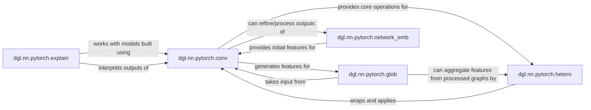

## Component Details

This subsystem, Graph Neural Network Framework, provides a comprehensive set of tools for building, training, and interpreting Graph Neural Networks (GNNs) within the DGL (Deep Graph Library) ecosystem, specifically tailored for PyTorch. It encompasses fundamental GNN layers, mechanisms for handling complex graph structures, pooling strategies for graph-level predictions, and modules for model interpretability.

### dgl.nn.pytorch.conv

This module is the cornerstone of the GNN framework, offering a diverse collection of graph convolutional layers (e.g., GATConv, SAGEConv, GraphConv, RelGraphConv, HGTConv, GINConv, GCN2Conv, APPNPConv, TAGConv, ChebConv, AGNNConv, TWIRLSConv, DGNConv). These layers implement the core message-passing mechanisms, defining how node features are aggregated from their neighbors and transformed to learn new, richer representations. They are fundamental for capturing local graph structure and propagating information across the graph.

**Related Classes/Methods**:

- `dgl.nn.pytorch.conv` (1:1)

### dgl.nn.pytorch.hetero

This module provides specialized layers and wrappers, such as HeteroGraphConv and HeteroLinear, designed to effectively process heterogeneous graphs—graphs that contain multiple types of nodes and edges. It enables the application of different GNN operations and transformations based on the specific node and edge types, which is crucial for modeling real-world complex relational data.

**Related Classes/Methods**:

- <a href="https://github.com/dmlc/dgl/blob/master/python/dgl/nn/pytorch/hetero.py#L1-L1" target="_blank" rel="noopener noreferrer">`dgl.nn.pytorch.hetero` (1:1)</a>

### dgl.nn.pytorch.glob

This module implements various global pooling mechanisms (e.g., GlobalAttentionPooling, Set2Set, AvgPooling, MaxPooling, SumPooling, SortPooling, SetAttentionBlock, PMALayer, SetTransformerEncoder, SetTransformerDecoder). These layers aggregate node representations from an entire graph (or a subgraph) into a single, fixed-size graph-level representation. This aggregation is vital for tasks that require a single output for the entire graph, such as graph classification or regression.

**Related Classes/Methods**:

- <a href="https://github.com/dmlc/dgl/blob/master/python/dgl/nn/pytorch/glob.py#L1-L1" target="_blank" rel="noopener noreferrer">`dgl.nn.pytorch.glob` (1:1)</a>

### dgl.nn.pytorch.network_emb

This module offers layers for learning low-dimensional, dense vector representations (embeddings) of nodes or edges, including NodeEmbedding and EdgeEmbedding. These embeddings are designed to capture the structural properties and relationships of entities within the graph, often serving as initial feature inputs for GNN models or for tasks like link prediction.

**Related Classes/Methods**:

- <a href="https://github.com/dmlc/dgl/blob/master/python/dgl/nn/pytorch/network_emb.py#L1-L1" target="_blank" rel="noopener noreferrer">`dgl.nn.pytorch.network_emb` (1:1)</a>

### dgl.nn.pytorch.explain

This module provides tools and methods, such as PGExplainer and HeteroPGExplainer, for interpreting the predictions made by GNN models. It helps users understand which specific parts of the input graph (nodes, edges, or subgraphs) are most influential in a model's decision, thereby enhancing model transparency and trustworthiness.

**Related Classes/Methods**:

- `dgl.nn.pytorch.explain` (1:1)

### [FAQ](https://github.com/CodeBoarding/GeneratedOnBoardings/tree/main?tab=readme-ov-file#faq)