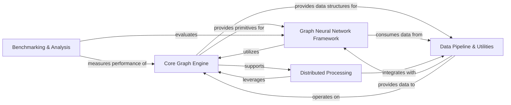

## Component Details

This analysis consolidates the DGL architecture into five high-level components, highlighting their responsibilities, key source files, and interrelationships.

### Core Graph Engine

The foundational layer of DGL, responsible for managing fundamental graph data structures (nodes, edges, attributes), providing low-level graph manipulation, and serving as the Foreign Function Interface (FFI) to the optimized C/C++ backend for high-performance operations. It also defines the core message passing primitives and sparse tensor operations essential for Graph Neural Networks.

**Related Classes/Methods**:

- <a href="https://github.com/dmlc/dgl/blob/master/python/dgl/heterograph.py#L0-L0" target="_blank" rel="noopener noreferrer">`dgl.heterograph` (0:0)</a>

- <a href="https://github.com/dmlc/dgl/blob/master/python/dgl/graph_index.py#L0-L0" target="_blank" rel="noopener noreferrer">`dgl.graph_index` (0:0)</a>

- <a href="https://github.com/dmlc/dgl/blob/master/python/dgl/frame.py#L0-L0" target="_blank" rel="noopener noreferrer">`dgl.frame` (0:0)</a>

- <a href="https://github.com/dmlc/dgl/blob/master/python/dgl/core.py#L0-L0" target="_blank" rel="noopener noreferrer">`dgl.core` (0:0)</a>

- `dgl._ffi` (0:0)

- <a href="https://github.com/dmlc/dgl/blob/master/python/dgl/ndarray.py#L0-L0" target="_blank" rel="noopener noreferrer">`dgl.ndarray` (0:0)</a>

- `dgl.sparse` (0:0)

- <a href="https://github.com/dmlc/dgl/blob/master/python/dgl/function/message.py#L0-L0" target="_blank" rel="noopener noreferrer">`dgl.function.message` (0:0)</a>

- <a href="https://github.com/dmlc/dgl/blob/master/python/dgl/function/reducer.py#L0-L0" target="_blank" rel="noopener noreferrer">`dgl.function.reducer` (0:0)</a>

- `dgl.ops` (0:0)

### Graph Neural Network Framework

Implements a comprehensive suite of Graph Neural Network (GNN) layers, attention mechanisms, and pooling layers compatible with various deep learning frameworks. It also includes modules for interpreting GNN model predictions to understand influential graph parts.

**Related Classes/Methods**:

- `dgl.nn.pytorch.conv` (0:0)

- <a href="https://github.com/dmlc/dgl/blob/master/python/dgl/nn/pytorch/hetero.py#L0-L0" target="_blank" rel="noopener noreferrer">`dgl.nn.pytorch.hetero` (0:0)</a>

- <a href="https://github.com/dmlc/dgl/blob/master/python/dgl/nn/pytorch/glob.py#L0-L0" target="_blank" rel="noopener noreferrer">`dgl.nn.pytorch.glob` (0:0)</a>

- <a href="https://github.com/dmlc/dgl/blob/master/python/dgl/nn/pytorch/network_emb.py#L0-L0" target="_blank" rel="noopener noreferrer">`dgl.nn.pytorch.network_emb` (0:0)</a>

- `dgl.nn.pytorch.explain` (0:0)

### Data Pipeline & Utilities

Manages all aspects of graph data, including built-in datasets, loading/saving graphs, and efficient data loading for GNN training (batching, lazy feature loading). It also provides various graph sampling algorithms, conversion utilities between graph representations, and general graph transformation functions. The high-performance GraphBolt framework is a key part of this component.

**Related Classes/Methods**:

- `dgl.data` (0:0)

- `dgl.dataloading` (0:0)

- `dgl.sampling` (0:0)

- <a href="https://github.com/dmlc/dgl/blob/master/python/dgl/convert.py#L0-L0" target="_blank" rel="noopener noreferrer">`dgl.convert` (0:0)</a>

- <a href="https://github.com/dmlc/dgl/blob/master/python/dgl/transforms/functional.py#L0-L0" target="_blank" rel="noopener noreferrer">`dgl.transforms.functional` (0:0)</a>

- <a href="https://github.com/dmlc/dgl/blob/master/python/dgl/transforms/module.py#L0-L0" target="_blank" rel="noopener noreferrer">`dgl.transforms.module` (0:0)</a>

- `dgl.utils` (0:0)

- <a href="https://github.com/dmlc/dgl/blob/master/python/dgl/homophily.py#L0-L0" target="_blank" rel="noopener noreferrer">`dgl.homophily` (0:0)</a>

- <a href="https://github.com/dmlc/dgl/blob/master/python/dgl/merge.py#L10-L123" target="_blank" rel="noopener noreferrer">`dgl.merge` (10:123)</a>

- <a href="https://github.com/dmlc/dgl/blob/master/python/dgl/readout.py#L0-L0" target="_blank" rel="noopener noreferrer">`dgl.readout` (0:0)</a>

- `dgl.graphbolt` (0:0)

### Distributed Processing

Enables scalable training and inference on large-scale graphs by providing distributed graph data structures, distributed data loaders, RPC mechanisms, and graph partitioning tools. It extends the core DGL functionalities for distributed environments.

**Related Classes/Methods**:

- `dgl.distributed` (0:0)

### Benchmarking & Analysis

Contains utilities for evaluating DGL's API performance, model accuracy, and speed. It includes implementations of common GNN models for testing and provides tools for analyzing model behavior.

**Related Classes/Methods**:

- `dgl.benchmarks` (0:0)

### [FAQ](https://github.com/CodeBoarding/GeneratedOnBoardings/tree/main?tab=readme-ov-file#faq)