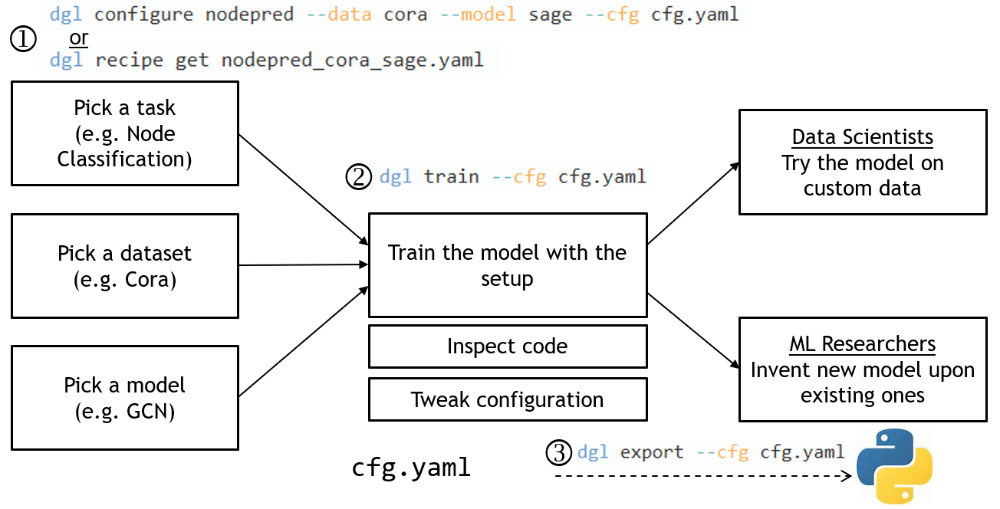

# DGL-Go


DGL-Go is a command line tool for users to get started with training, using and
studying Graph Neural Networks (GNNs). Data scientists can quickly apply GNNs
to their problems, whereas researchers will find it useful to customize their
experiments.


## Installation and get started

DGL-Go requires DGL v0.8+ so please make sure DGL is updated properly.

### Install the latest stable version

```
pip install dglgo
```

### Install from source for experimental features

```
python setup.py install
```

### Get started

Type `dgl` in your console:

```
Usage: dgl [OPTIONS] COMMAND [ARGS]...

Options:
  --help  Show this message and exit.

Commands:
  configure  Generate a configuration file
  export     Export a runnable python script
  recipe     Get example recipes
  train      Launch training
```

<p align="center">
  
</p>

Using DGL-Go is as easy as three steps:

1. Use `dgl configure` to pick the task, dataset and model of your interests. It generates
   a configuration file for later use. You could also use `dgl recipe get` to retrieve
   a configuration file we provided.
1. Use `dgl train` to launch training according to the configuration and see the results.
1. Use `dgl export` to generate a *self-contained, reproducible* Python script for advanced
   customization, or try the model on custom data stored in CSV format.

Next, we will walk through all these steps one-by-one.

## Training GraphSAGE for node classification on Cora

Let's use one of the most classical setups -- training a GraphSAGE model for node
classification on the Cora citation graph dataset as an
example.

### Step 1: `dgl configure`

First step, use `dgl configure` to generate a YAML configuration file.

```
dgl configure nodepred --data cora --model sage --cfg cora_sage.yaml
```

Note that `nodepred` is the name of DGL-Go *pipeline*. For now, you can think of
pipeline as training task: `nodepred` is for node multiclass classification task; other
options include `linkpred` for link prediction task, and `graphpred` for graph binary classification etc. The command will
generate a configurate file `cora_sage.yaml` which includes:

* Options for the selected dataset (i.e., `cora` here).
* Model hyperparameters (e.g., number of layers, hidden size, etc.).
* Training hyperparameters (e.g., learning rate, loss function, etc.).

Different choices of task, model and datasets may give very different options,
so DGL-Go also adds a comment per option for explanation.
At this point you can also change options to explore optimization potentials.

The snippet below shows the configuration file generated by the command above.

```yaml
version: 0.0.2
pipeline_name: nodepred
pipeline_mode: train
device: cpu
data:
  name: cora
  split_ratio:                # Ratio to generate split masks, for example set to [0.8, 0.1, 0.1] for 80% train/10% val/10% test. Leave blank to use builtin split in original dataset
model:
  name: sage
  embed_size: -1              # The dimension of created embedding table. -1 means using original node embedding
  hidden_size: 16             # Hidden size.
  num_layers: 1               # Number of hidden layers.
  activation: relu            # Activation function name under torch.nn.functional
  dropout: 0.5                # Dropout rate.
  aggregator_type: gcn        # Aggregator type to use (``mean``, ``gcn``, ``pool``, ``lstm``).
general_pipeline:
  early_stop:
    patience: 20              # Steps before early stop
    checkpoint_path: checkpoint.pth # Early stop checkpoint model file path
  num_epochs: 200             # Number of training epochs
  eval_period: 5              # Interval epochs between evaluations
  optimizer:
    name: Adam
    lr: 0.01
    weight_decay: 0.0005
  loss: CrossEntropyLoss
  save_path: results          # Directory to save the experiment results
  num_runs: 1                 # Number of experiments to run
```

Apart from `dgl configure`, you could also get one of DGL-Go's built-in configuration files
(called *recipe*) using `dgl recipe`. There are two sub-commands:

```
dgl recipe list
```

will list the available recipes:

```
➜ dgl recipe list
===============================================================================
| Filename                       |  Pipeline           | Dataset              |
===============================================================================
| graphpred_pcba_gin.yaml        |  graphpred          | ogbg-molpcba         |
| graphpred_hiv_pna.yaml         |  graphpred          | ogbg-molhiv          |
| graphpred_hiv_gin.yaml         |  graphpred          | ogbg-molhiv          |
| linkpred_citation2_sage.yaml   |  linkpred           | ogbl-citation2       |
| linkpred_collab_sage.yaml      |  linkpred           | ogbl-collab          |
| nodepred_citeseer_sage.yaml    |  nodepred           | citeseer             |
| nodepred_citeseer_gcn.yaml     |  nodepred           | citeseer             |
| nodepred-ns_arxiv_gcn.yaml     |  nodepred-ns        | ogbn-arxiv           |
| nodepred_cora_gat.yaml         |  nodepred           | cora                 |
| nodepred_pubmed_sage.yaml      |  nodepred           | pubmed               |
| linkpred_cora_sage.yaml        |  linkpred           | cora                 |
| nodepred_pubmed_gcn.yaml       |  nodepred           | pubmed               |
| nodepred_pubmed_gat.yaml       |  nodepred           | pubmed               |
| nodepred_cora_gcn.yaml         |  nodepred           | cora                 |
| nodepred_cora_sage.yaml        |  nodepred           | cora                 |
| nodepred_citeseer_gat.yaml     |  nodepred           | citeseer             |
| nodepred-ns_product_sage.yaml  |  nodepred-ns        | ogbn-products        |
===============================================================================
```

Then use

```
dgl recipe get nodepred_cora_sage.yaml
```

to copy the YAML configuration file to your local folder.

### Step 2: `dgl train`

Simply run `dgl train --cfg cora_sage.yaml` will start the training process.
```log
...
Epoch 00190 | Loss 1.5225 | TrainAcc 0.9500 | ValAcc 0.6840
Epoch 00191 | Loss 1.5416 | TrainAcc 0.9357 | ValAcc 0.6840
Epoch 00192 | Loss 1.5391 | TrainAcc 0.9357 | ValAcc 0.6840
Epoch 00193 | Loss 1.5257 | TrainAcc 0.9643 | ValAcc 0.6840
Epoch 00194 | Loss 1.5196 | TrainAcc 0.9286 | ValAcc 0.6840
EarlyStopping counter: 12 out of 20
Epoch 00195 | Loss 1.4862 | TrainAcc 0.9643 | ValAcc 0.6760
Epoch 00196 | Loss 1.5142 | TrainAcc 0.9714 | ValAcc 0.6760
Epoch 00197 | Loss 1.5145 | TrainAcc 0.9714 | ValAcc 0.6760
Epoch 00198 | Loss 1.5174 | TrainAcc 0.9571 | ValAcc 0.6760
Epoch 00199 | Loss 1.5235 | TrainAcc 0.9714 | ValAcc 0.6760
Test Accuracy 0.7740
Accuracy across 1 runs: 0.774 ± 0.0
```

That's all! Basically you only need two commands to train a graph neural network.

### Step 3: `dgl export` for more advanced customization

That's not everything yet. You may want to open the hood and invoke deeper
customization. DGL-Go can export a **self-contained, reproducible** Python
script for you to do anything you like.

Try `dgl export --cfg cora_sage.yaml --output script.py`,
and you'll get the script used to train the model. Here's the code snippet:

```python
...

class GraphSAGE(nn.Module):
    def __init__(self,
                 data_info: dict,
                 embed_size: int = -1,
                 hidden_size: int = 16,
                 num_layers: int = 1,
                 activation: str = "relu",
                 dropout: float = 0.5,
                 aggregator_type: str = "gcn"):
        """GraphSAGE model

        Parameters
        ----------
        data_info : dict
            The information about the input dataset.
        embed_size : int
            The dimension of created embedding table. -1 means using original node embedding
        hidden_size : int
            Hidden size.
        num_layers : int
            Number of hidden layers.
        dropout : float
            Dropout rate.
        activation : str
            Activation function name under torch.nn.functional
        aggregator_type : str
            Aggregator type to use (``mean``, ``gcn``, ``pool``, ``lstm``).
        """
        super(GraphSAGE, self).__init__()
        self.data_info = data_info
        self.embed_size = embed_size
        if embed_size > 0:
            self.embed = nn.Embedding(data_info["num_nodes"], embed_size)
            in_size = embed_size
        else:
            in_size = data_info["in_size"]
        self.layers = nn.ModuleList()
        self.dropout = nn.Dropout(dropout)
        self.activation = getattr(nn.functional, activation)

        for i in range(num_layers):
            in_hidden = hidden_size if i > 0 else in_size
            out_hidden = hidden_size if i < num_layers - \
                1 else data_info["out_size"]
            self.layers.append(
                dgl.nn.SAGEConv(
                    in_hidden,
                    out_hidden,
                    aggregator_type))

    def forward(self, graph, node_feat, edge_feat=None):
        if self.embed_size > 0:
            dgl_warning(
                "The embedding for node feature is used, and input node_feat is ignored, due to the provided embed_size.")
            h = self.embed.weight
        else:
            h = node_feat
        h = self.dropout(h)
        for l, layer in enumerate(self.layers):
            h = layer(graph, h, edge_feat)
            if l != len(self.layers) - 1:
                h = self.activation(h)
                h = self.dropout(h)
        return h

...

def train(cfg, pipeline_cfg, device, data, model, optimizer, loss_fcn):
    g = data[0]  # Only train on the first graph
    g = dgl.remove_self_loop(g)
    g = dgl.add_self_loop(g)
    g = g.to(device)

    node_feat = g.ndata.get('feat', None)
    edge_feat = g.edata.get('feat', None)
    label = g.ndata['label']
    train_mask, val_mask, test_mask = g.ndata['train_mask'].bool(
    ), g.ndata['val_mask'].bool(), g.ndata['test_mask'].bool()

    stopper = EarlyStopping(**pipeline_cfg['early_stop'])

    val_acc = 0.
    for epoch in range(pipeline_cfg['num_epochs']):
        model.train()
        logits = model(g, node_feat, edge_feat)
        loss = loss_fcn(logits[train_mask], label[train_mask])

        optimizer.zero_grad()
        loss.backward()
        optimizer.step()

        train_acc = accuracy(logits[train_mask], label[train_mask])
        if epoch != 0 and epoch % pipeline_cfg['eval_period'] == 0:
            val_acc = accuracy(logits[val_mask], label[val_mask])

            if stopper.step(val_acc, model):
                break

        print("Epoch {:05d} | Loss {:.4f} | TrainAcc {:.4f} | ValAcc {:.4f}".
              format(epoch, loss.item(), train_acc, val_acc))

    stopper.load_checkpoint(model)
    stopper.close()

    model.eval()
    with torch.no_grad():
        logits = model(g, node_feat, edge_feat)
        test_acc = accuracy(logits[test_mask], label[test_mask])
    return test_acc


def main(run, cfg, data):
    device = cfg['device']
    pipeline_cfg = cfg['general_pipeline']
    # create model
    model = GraphSAGE(**cfg["model"])
    model = model.to(device)
    loss = torch.nn.CrossEntropyLoss()
    optimizer = torch.optim.Adam(
        model.parameters(),
        **pipeline_cfg["optimizer"])
    # train
    test_acc = train(cfg, pipeline_cfg, device, data, model, optimizer, loss)
    torch.save({'cfg': cfg, 'model': model.state_dict()},
               os.path.join(pipeline_cfg["save_path"], 'run_{}.pth'.format(run)))

    return test_acc

if __name__ == '__main__':
    ...

    # load data
    data = AsNodePredDataset(CoraGraphDataset())

    model_cfg = cfg["model"]
    cfg["model"]["data_info"] = {
        "in_size": model_cfg['embed_size'] if model_cfg['embed_size'] > 0 else data[0].ndata['feat'].shape[1],
        "out_size": data.num_classes,
        "num_nodes": data[0].num_nodes()
    }

    os.makedirs(cfg['general_pipeline']["save_path"])

    all_acc = []
    num_runs = 1
    for run in range(num_runs):
        print(f'Run experiment #{run}')
        test_acc = main(run, cfg, data)
        print("Test Accuracy {:.4f}".format(test_acc))
        all_acc.append(test_acc)
    avg_acc = np.round(np.mean(all_acc), 6)
    std_acc = np.round(np.std(all_acc), 6)
    print(f'Accuracy across {num_runs} runs: {avg_acc} ± {std_acc}')
```

You can see that everything is collected into one Python script which includes the
entire `GraphSAGE` model definition, data processing and training loop. Simply running
`python script.py` will give you the *exact same* result as you've seen by `dgl train`.
At this point, you can change any part as you wish such as plugging your own GNN module,
changing the loss function and so on.

## Use DGL-Go on your own dataset

DGL-Go supports training a model on custom dataset by DGL's `CSVDataset`.

### Step 1: Prepare your CSV and metadata file.

Follow the tutorial at [Loading data from CSV
files](https://docs.dgl.ai/en/latest/guide/data-loadcsv.html#guide-data-pipeline-loadcsv`)
to prepare your dataset. Generally, the dataset folder should include:
* At least one CSV file for node data.
* At least one CSV file for edge data.
* A metadata file called `meta.yaml`.

### Step 2: `dgl configure` with `--data csv` option
Run

```
dgl configure nodepred --data csv --model sage --cfg csv_sage.yaml
```

to generate the configuration file. You will see that the file includes a section like
the followings:

```yaml
...
data:
  name: csv
  split_ratio:                # Ratio to generate split masks, for example set to [0.8, 0.1, 0.1] for 80% train/10% val/10% test. Leave blank to use builtin split in original dataset
  data_path: ./               # metadata.yaml, nodes.csv, edges.csv should in this folder
...
```

Fill in the `data_path` option with the path to your dataset folder.

If your dataset does not have any native split for training, validation and test sets,
you can set the split ratio in the `split_ratio` option, which will
generate a random split for you.

### Step 3: `train` the model / `export` the script
Then you can do the same as the tutorial above, either train the model by
`dgl train --cfg csv_sage.yaml` or use `dgl export --cfg csv_sage.yaml
--output script.py` to get the training script.

## FAQ

**Q: What are the available options for each command?**
A: You can use `--help` for all commands. For example, use `dgl --help` for general
help message; use `dgl configure --help` for the configuration options; use
`dgl configure nodepred --help` for the configuration options of node prediction pipeline.

**Q: What exactly is nodepred/linkpred? How many are they?**
A: They are called DGL-Go pipelines. A pipeline represents the training methodology for
a certain task. Therefore, its naming convention is *<task_name>[-<method_name>]*. For example,
`nodepred` trains the selected GNN model for node classification using full-graph training method;
while `nodepred-ns` trains the model for node classifiation but using neighbor sampling.
Currently DGL-Go provides four training pipelines (`nodepred`, `nodepred-ns`, `linkpred`, and `graphpred`). Use `dgl configure --help` to see
all the available pipelines.

**Q: How to add my model to the official model recipe zoo?**
A: Currently not supported. We will enable this feature soon. Please stay tuned!

**Q: After training a model on some dataset, how can I apply it to another one?**
A: The `save_path` option in the generated configuration file allows you to specify the directory to save the experiment results. After training, `{save_path}/run_{i}.pth` will be the checkpoint for the i-th run, consisting of the training configuration and trained model state dict. You can then use `dgl apply` as follows.

```
dgl configure-apply X --data Y --cpt {save_path}/run_{i}.pth --cfg Z
dgl apply --cfg Z
```

- `X` is the pipeline name as in `dgl configure`.
- `Y` is the dataset to apply and can be omitted if you are applying the trained model to the training dataset.
- `Z` is the configuration file and a default value will be used if not specified.

You can also use `dgl export --cfg Z` to generate a python script for further modification.
