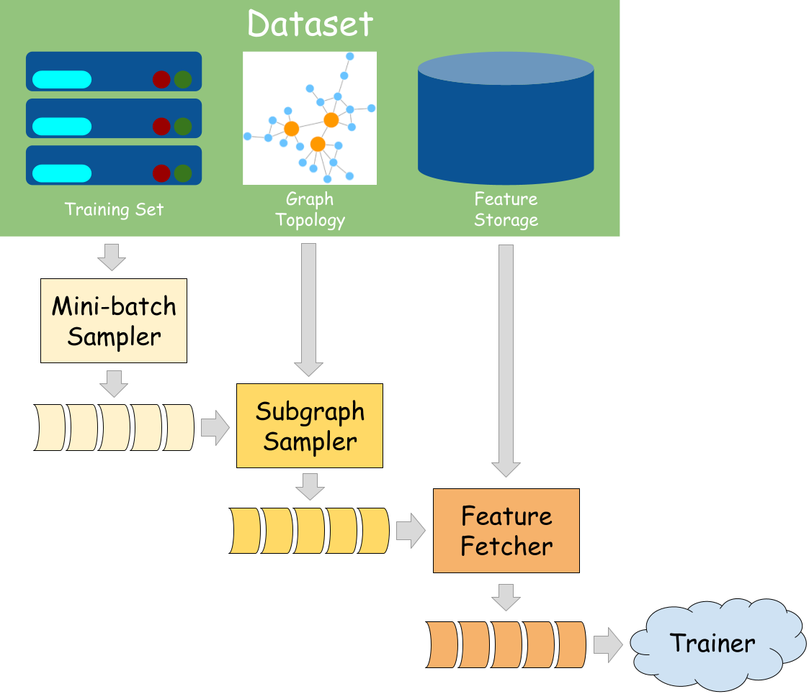

🆕 Stochastic Training of GNNs with GraphBolt
=============================================

GraphBolt is a data loading framework for GNN with high flexibility and
scalability. It is built on top of DGL and PyTorch.

This tutorial introduces how to enable stochastic training of GNNs with
GraphBolt.

Overview
^^^^^^^

GraphBolt integrates seamlessly with the PyTorch `datapipe <https://pytorch.org/data/beta/torchdata.datapipes.iter.html>`_, relying on the unified "MiniBatch" data structure to connect processing stages. It streamlines data loading and preprocessing for GNN training, validation, and testing.
By default, GraphBolt provides a collection of built-in datasets and exceptionally efficient implementations of datapipes for common scenarios, which can be summarized as follows:

1. **Item Sampler:** Randomly selects a subset (nodes, edges, graphs) from the entire training set as an initial mini-batch for downstream computation.

2. **Negative Sampler:** Specially designed for link prediction tasks, it generates non-existing edges as negative examples for training.

3. **Subgraph Sampler:** Generates subgraphs based on the input nodes/edges for computation.

4. **Feature Fetcher:** Fetches related node/edge features from the dataset for the given input.

By exposing the entire data loading process as a pipeline, GraphBolt provides significant flexibility and customization opportunities. Users can easily substitute any stage with their own implementations. Additionally, users can benefit from the optimized scheduling strategy for datapipes, even with customized stages.

In summary, GraphBolt offers the following benefits:

1. A flexible, pipelined framework for GNN data loading and preprocessing.

2. Highly efficient canonical implementations.

3. Efficient scheduling.

Scenarios
^^^^^^^

.. toctree::
  :maxdepth: 1

  neighbor_sampling_overview.nblink
  node_classification.nblink
  link_prediction.nblink
  multigpu_node_classification.nblink
  ondisk-dataset.rst
