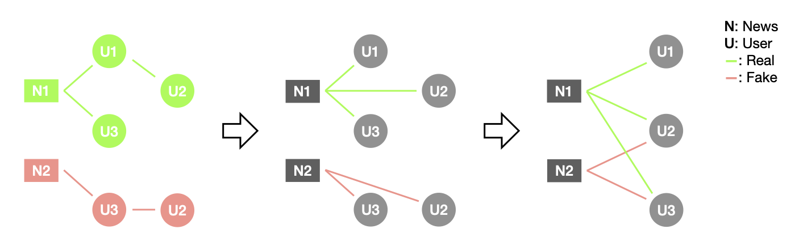

# DGL Implementation of the GAS Paper

This DGL example implements the Heterogeneous GCN part of the model proposed in the paper [Spam Review Detection with Graph Convolutional Networks](https://arxiv.org/abs/1908.10679).

Example implementor
----------------------
This example was implemented by [Kay Liu](https://github.com/kayzliu) during his SDE intern work at the AWS Shanghai AI Lab.

Dependencies
----------------------
- Python 3.7.10
- PyTorch 1.8.1
- dgl 0.7.0
- scikit-learn 0.23.2

Dataset
---------------------------------------
The datasets used for edge classification are variants of DGL's built-in [fake news datasets](https://github.com/dmlc/dgl/blob/master/python/dgl/data/fakenews.py). The converting process from tree-structured graph to bipartite graph is shown in the figure. 



**NOTE**: Same as the original fake news dataset, this variant is for academic use only as well, and commercial use is prohibited. The statistics are summarized as followings:

**Politifact**

- Nodes:
    - user (u): 276,277
    - news (v): 581
- Edges:
    - forward: 399,016
    - backward: 399,016
- Number of Classes: 2
- Node feature size: 300
- Edge feature size: 300

**Gossicop** 

- Nodes:
    - user (u): 565,660
    - news (v): 10,333
- Edges:
    - forward: 1,254,469
    - backward: 1,254,469
- Number of Classes: 2
- Node feature size: 300
- Edge feature size: 300

How to run
--------------------------------
In the gas folder, run
```
python main.py
```

If want to use a GPU, run
```
python main.py --gpu 0
```

If the mini-batch training is required to run on a GPU, run
```
python main_sampling.py --gpu 0
```

Performance
-------------------------
|Dataset               | Xianyu Graph (paper reported) | Fake News Politifact | Fake News Gossipcop |
| -------------------- | ----------------- | -------------------- | ------------------- |
| F1                   | 0.8143            | 0.9994               | 0.9942              |
| AUC                  | 0.9860            | 1.0000               | 0.9991              |
| Recall@90% precision | 0.6702            | 0.9999               | 0.9976              |