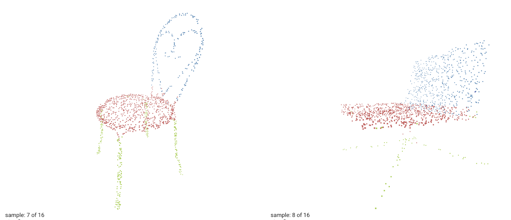

PointNet and PointNet++ for Point Cloud Classification and Segmentation
====

This is a reproduction of the papers
- [PointNet: Deep Learning on Point Sets for 3D Classification and Segmentation](https://arxiv.org/abs/1612.00593).
- [PointNet++: Deep Hierarchical Feature Learning on Point Sets in a Metric Space](https://arxiv.org/abs/1706.02413).

# Performance

## Classification
| Model           | Dataset    | Metric   | Score - PyTorch  | Score - DGL |
|-----------------|------------|----------|------------------|-------------|
| PointNet        | ModelNet40 | Accuracy | 89.2(Official)   | 89.3        |
| PointNet++(SSG) | ModelNet40 | Accuracy | 92.4             | 93.3        |
| PointNet++(MSG) | ModelNet40 | Accuracy | 92.8             | 93.3        |

## Part Segmentation

| Model           | Dataset    | Metric   | Score - PyTorch | Score - DGL |
|-----------------|------------|----------|-----------------|-------------|
| PointNet        | ShapeNet   | mIoU     | 84.3            | 83.6        |
| PointNet++(SSG) | ShapeNet   | mIoU     | 84.9            | 84.5        |
| PointNet++(MSG) | ShapeNet   | mIoU     | 85.4            | 84.6        |

Score - PyTorch data are collected from [this repo](https://github.com/yanx27/Pointnet_Pointnet2_pytorch).
# How to Run

For point cloud classification, run with

```python
python train_cls.py
```

For point cloud part-segmentation, run with

```python
python train_partseg.py
```

## To Visualize Part Segmentation in Tensorboard

First ``pip install tensorboard``
then run
```python 
python train_partseg_with_visualization.py
```
To use Tensorboard, run 
``tensorboard --logdir=runs``
