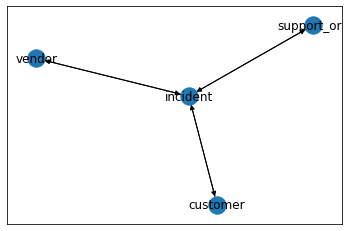

# Heterograph Convolution with ArangoDB for Incidence Management

This example illustrates the use of DGL to develop node embedding and perform supervised learning on a heterogeneous graph with node features. The data for this example comes from the [UCI machine learning repository](https://archive.ics.uci.edu/ml/datasets/Incident+management+process+enriched+event+log) and is the event log from incident management (help desk) application. The data is
a dump from a relational database. We modeled this as a graph problem with
the following abstractions:

   1. The  Incident
   2. The support organization assigned to work on resolving the incident
   3. The customer who reported the incident
   4. The vendor or product associated with the incident
   

A schematic of the graph is shown below:

Each of these abstractions forms the vertices of a graph. Each vertex has a
set of features. Since each vertex is a distinct entity, the graph is a
heterogeneous one with features for each node. The task is to develop the
embeddings associated with these abstractions. The analysis consists of the
following steps. We have a notebook corresponding to each step:

   1. Exploratory Data Analysis: We analyze the data, examine the data
   types and pick a node attribute to predict. For this problem, we picked an
   engineered attribute. The attribute to predict captures if the ticket is
   reassigned. The rationale for picking this feature was the following. This
   attribute indicates if the process of the resolution was done effectively.
   Importantly, this attribute has a good balance from the point of view of
   supervised learning. About 50% of the tickets are reassigned and is the
   property/attribute of the incident vertex. The analysis is captured in the notebook [ITSM_EDA.ipynb](
   https://github.com/arangoml/dgl/blob/managed_services_version_with_sampling/tutorials/models/hetro-graph-with-node-features/ITSM_EDA.ipynb)
   .
   2. Data Preprocessing: This step prepares the data for analysis using
   DGL. The data is a dump from a relational database. This data must be
   massaged to a form that is suitable for analysis by DGL using Pytorch as
   the backend. The activity is captured in the notebook [batch_graph_pre-processing.ipynb](
   https://github.com/arangoml/dgl/blob/managed_services_version_with_sampling/tutorials/models/hetro-graph-with-node-features/batch_graph_pre-processing.ipynb)
   3. Data loading utility development: We chose Pytorch as the backend for
   DGL. The data loader loads the preprocessed data from the previous step
   into ArangoDB. DGL works with a NetworkX version of the graph. So the data
   loader also provides this. The data loader is captured in the following
   notebook [ITSM_data_loader.py](
   https://github.com/arangoml/dgl/blob/managed_services_version_with_sampling/tutorials/models/hetro-graph-with-node-features/ITSM_data_loader.py).  
   **Note:** The data loader uses a managed service version of ArangoDB. No installation of ArangoDB is necessary to run the examples. It is possible to load the entire data into the database, however, in the interest of making it possible to run the example quickly, we have loaded a sample of the data into the database.
   
   4. Model development: This is the contribution of this work. A
   heterogeneous graph convolution network with node features is implemented.
   All features were categorical. The discretization of numerical attributes
   is performed as part of pre-processing. An embedding layer is created to
   capture the embedding for each feature. Each node state is the combined
   representation of all its features. Therefore the input to each node is of
   the size = number of features for the node * size of the embedding for each
   feature.  The network consists of two layers. A cross-entropy loss was used
   for this problem.  20% of the data was used for testing and 80% of the data
   was used for training. The notebook [TSM_Graph_Embedding.ipynb
contains](
   https://github.com/arangoml/dgl/blob/managed_services_version_with_sampling/tutorials/models/hetro-graph-with-node-features/ITSM_Graph_Embedding.ipynb)
contains
   the details of model development.

As a result of developing this model, the following outcomes are achieved:

   - We have a supervised learning model for prediction of the label of
   interest  - is an incident going to be reassigned in the course of its
   resolution?
   - We have embeddings for the nodes and the features associated with the
   nodes. These may be useful in their own right. For example, they can be
   used to determine how similar two incidents are using a similarity metric,
   for example, the euclidean distance. These embeddings can be captured and
   used for other machine learning applications using the same data. For
   example, clustering the support organization can yield insights into how
   the work in the support organization is segmented.

 